# Visual Studio Code

## 介绍

> Free and built on open source. Integrated Git, debugging and extensions

## 安装

访问 [VS Code 安装](https://code.visualstudio.com/download) 页 ，然后选择 32 或 64 位安装程序进行安装

## 简介

VSCode 主要界面和功能如下图所示。作者的 VSCode 已经被很好的配置过，因此多了一些选项


## 插件配置

我们进入插件市场，搜素安装以下插件：
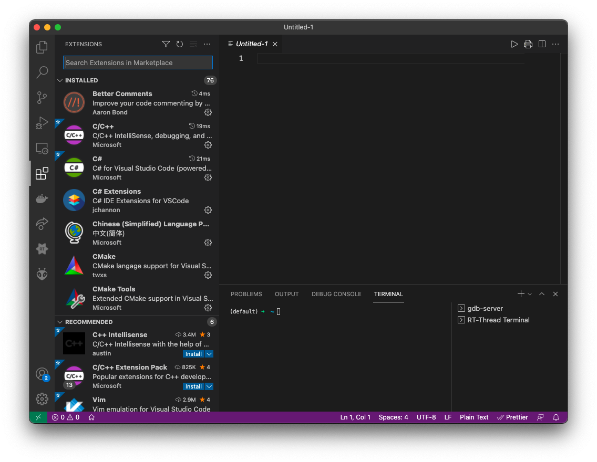

-   C/C++ (智能跳转支持)
-   Chinese (Simplified) Language Pack for Visual Studio Code (中文)
-   CMake (CMake 支持)
-   CMake Tools (CMake 工具)

Windows 用户连接到 WSL 需要安装的插件是：

-   Remote - WSL

安装完成后，Windows/Linux 用户按下`Ctrl+Shift+P`，MacOS 用户按下`Command+Shift+P`可以呼出**命令面板**。命令面板是很重要的。在命令面板中输入"Configure Display Language" 可以配置显示语言

以上是本次课程需要用到的插件。除此之外另推荐安装的插件有:

-   Python
-   Jupyter
-   Git Graph
-   Hex Editor
-   Latex Workshop
-   Markdown All in One

若要安装某款插件，只需要搜索它的名称，点击搜索结果并在详情页中选择安装即可。

## 工作流

使用 VSCode 的工作流程（从零开始）是这样的：

1. 启动 VSCode
2. 定位到工作目录
3. 配置 VSCode 编译调试环境
4. 在工作目录下创建代码文件，编写代码
5. 在 VSCode 的辅助下，利用编译器编译代码
6. 在 VSCode 的辅助下，利用调试器编译代码
7. 重复 4-6 的步骤...

首先，启动 VSCode，然后打开文件选项卡。此时的 VSCode 尚未打开任何目录，因此选择 Open Folder 按钮并打开工作目录
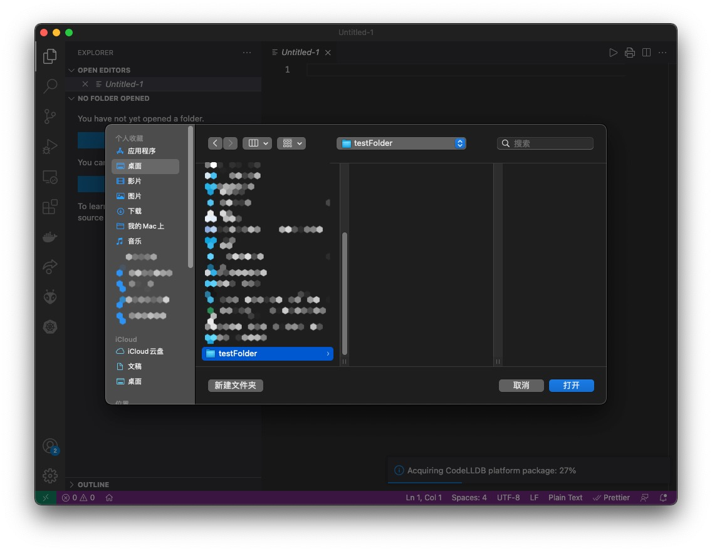

> 可能会弹出是否信任改目录，信任

对于 Windows+WSL 用户，他们需要安装 Remote - WSL 插件后，在远程选项卡中选择并打开 WSL 环境，然后定位并打开工作目录。

>***特别注意***
>
>WSL的存储分为总体来说可以分为两部分：
>
>- 和Windows共享的
>- WSL独享的
>
>其中Windows共享的部分在 WSL 中被映射到`/mnt`目录下。比如，C盘对应着`/mnt/c/`。
>
>WSL中的`/home`目录是WSL独享的，无法从文件管理器中直接访问
>
>如果要在WSL中打开Windows系统内的文件，要手动在对话框中输入路径，而不能选择"显示本地"
>
>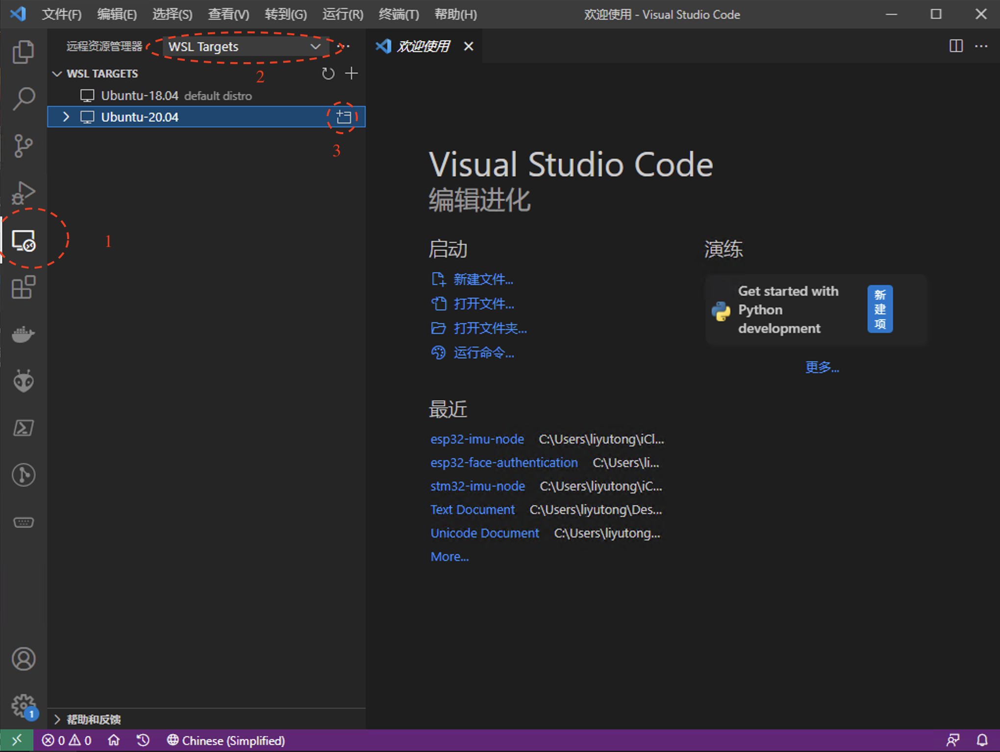
>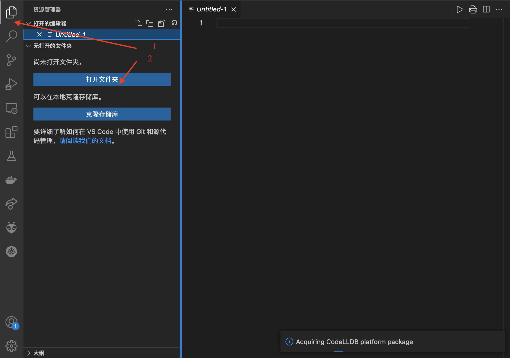
>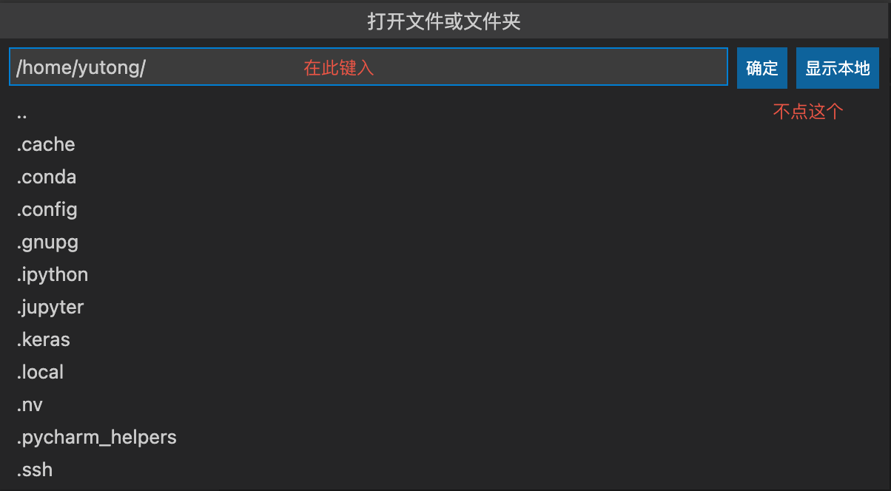

一般情况下，VSCode 自动初始化该目录并在该目录下生成`.vscode`子目录。其中的`settings.json`记录了当前目录的配置。*没生成也没关系*

成功连接WSL后，VSCode窗口的左下角会显示绿色的“WSL-xxxx”字样

> 注意
> WSL用户在连接WSL后，请访问拓展程序面板再次确认插件已经安装

我们新建一个`main.c`文件，写一段小程序

```c
#include <stdio.h>

int main(int argc, const char * argv[]) {
    printf("Hello, world!\n");
    return 0;
}
```

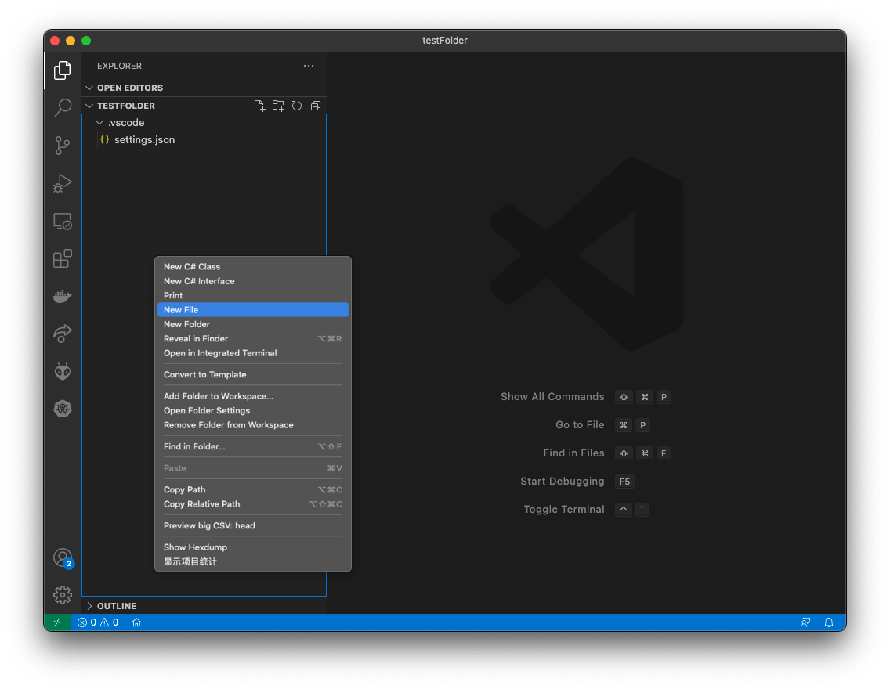


使用终端菜单中的`New Terminal`可以新建一个当前目录下的终端窗口。
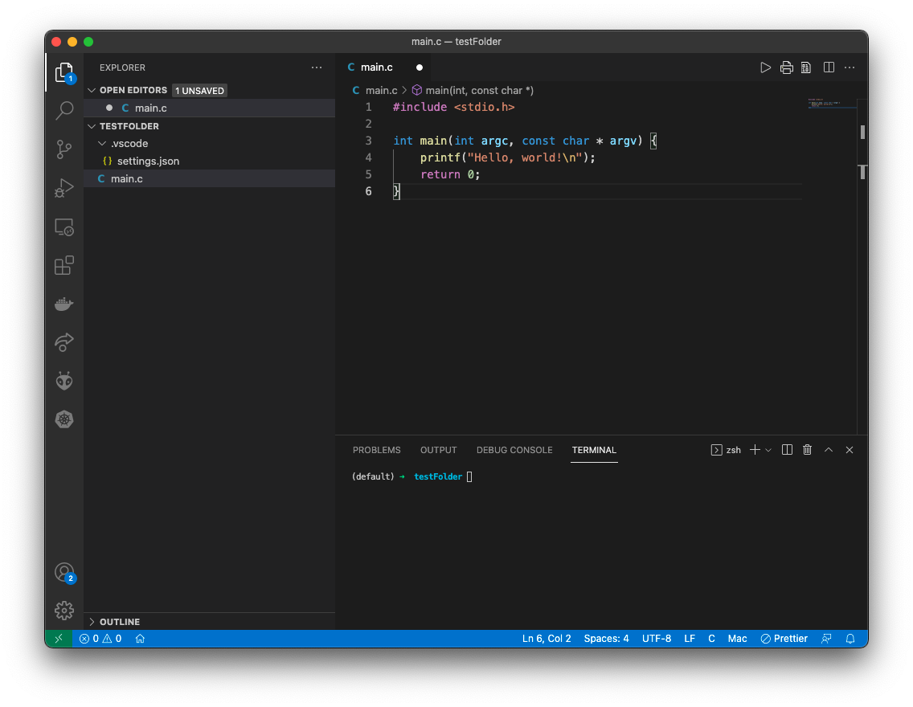

在终端窗口中，键入`gcc main.c -o main`，并按下回车执行。

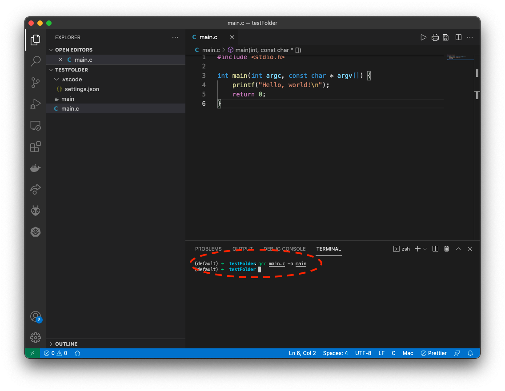

-   `gcc` 命令启动 gcc 编译器
-   `main.c` C 源文件
-   `-o` 生成二进制文件
-   `main` 生成的二进制文件名

这样，一个名为`main`的可执行文件就被创建出来了。在终端中执行`./main`可以得到运行结果。

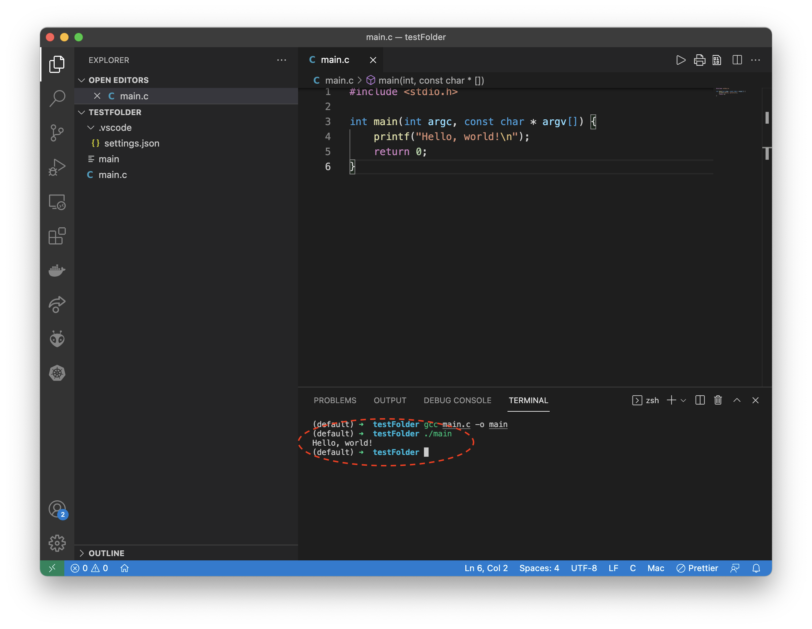

## 编译

现在我们通过 CMake 工具自动化。我们创建一个`CMakeLists.txt`文件(**注意拼写和大小写**)并添加以下内容：

```cmake
project(testProject C)
set(CMAKE_BUILD_TYPE "Debug")
set(CMAKE_CXX_FLAGS “${CMAKE_CXX_FLAGS} -g”)
add_executable(main main.c)
```

-   这个项目的名字是`testProject`
-   这个项目语言是 C
-   编译的类型是 Debug
-   `-g`创建符号表，关闭所有的优化机制
-   添加一个叫做`main`的可执行文件，用`main.c`编译

保存文件，然后打开 VSCode 命令面板，输入`cmake configure`，并执行 CMake：配置。CMake 插件会令你选择一个编译工具链。
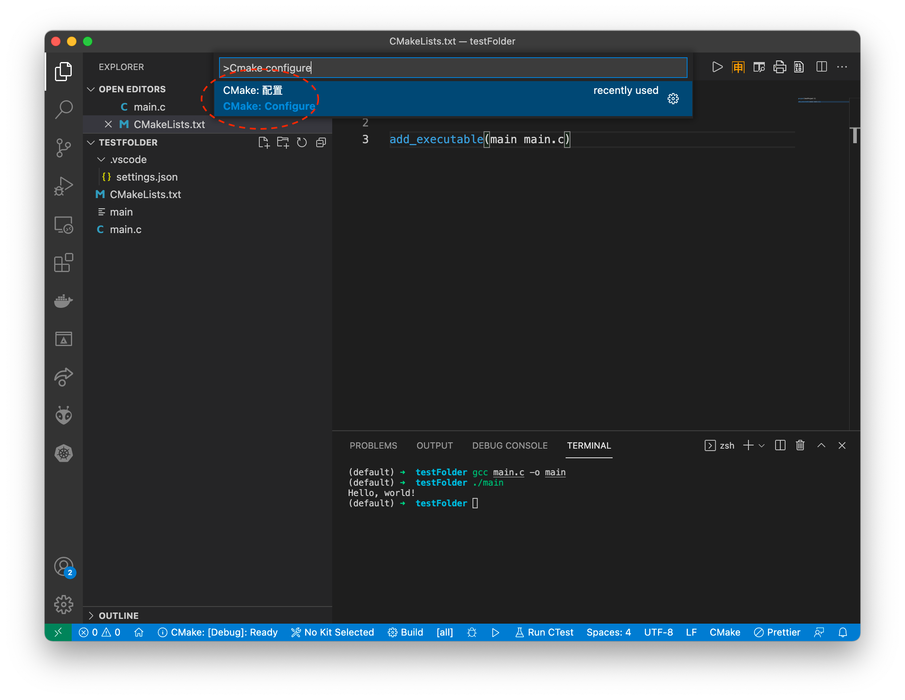
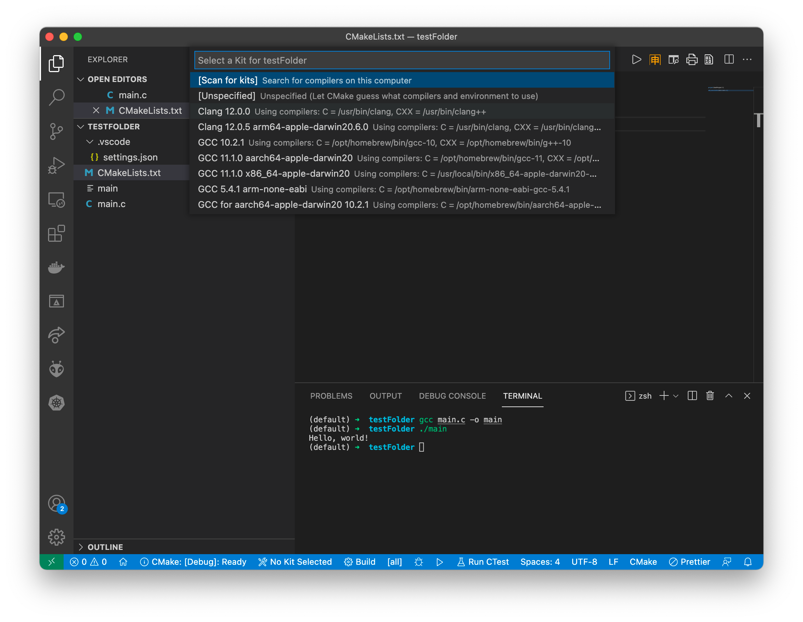

选择 GCC 工具链。不同操作系统上选项可能不同：

-   Windows 上是 MinGW 或 MSVC
-   Linux 上是 GCC
-   MacOS 上是 Clang 或 GCC（GCC 需要额外配置 GDB）

CMake 配置完成后，下方状态栏的`Build`按钮就可以使用了。如果一切顺利，点击`Build`后便会生成可执行文件。该文件在`./build`目录下。

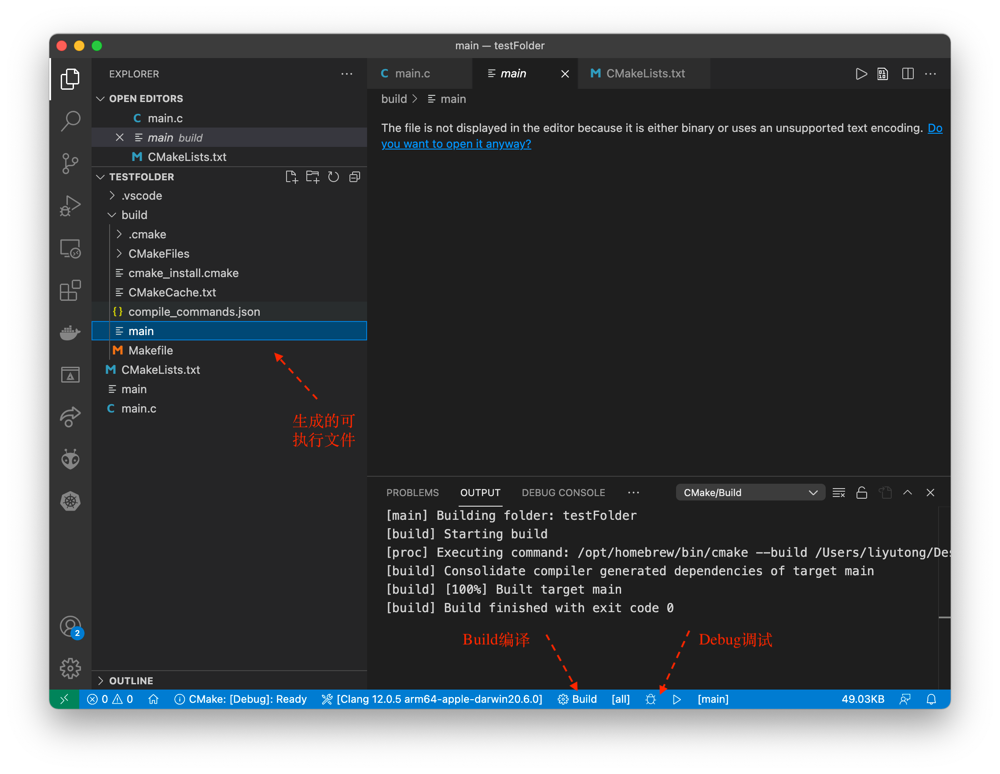

## 调试

点击臭虫标志可以启动调试。所谓调试（Debug），就是让代码一步一步慢慢执行，跟踪程序的运行过程。比如，可以让程序停在某个地方，查看当前所有变量的值，或者内存中的数据；也可以让程序一次只执行一条或者几条语句，看看程序到底执行了哪些代码。

调试需要有调试器（Debugger），不同平台的调试器也不同：

-   Windows：Remote Debugger
-   MacOS: LLDB
-   Linux(WSL): GDB

VSCode 的 CMake 插件会自动寻找调试器。

为了进行调试，需要在程序中设定断点。要想设定断点，只要在想要设定断点的地方点击代码左侧的空白。

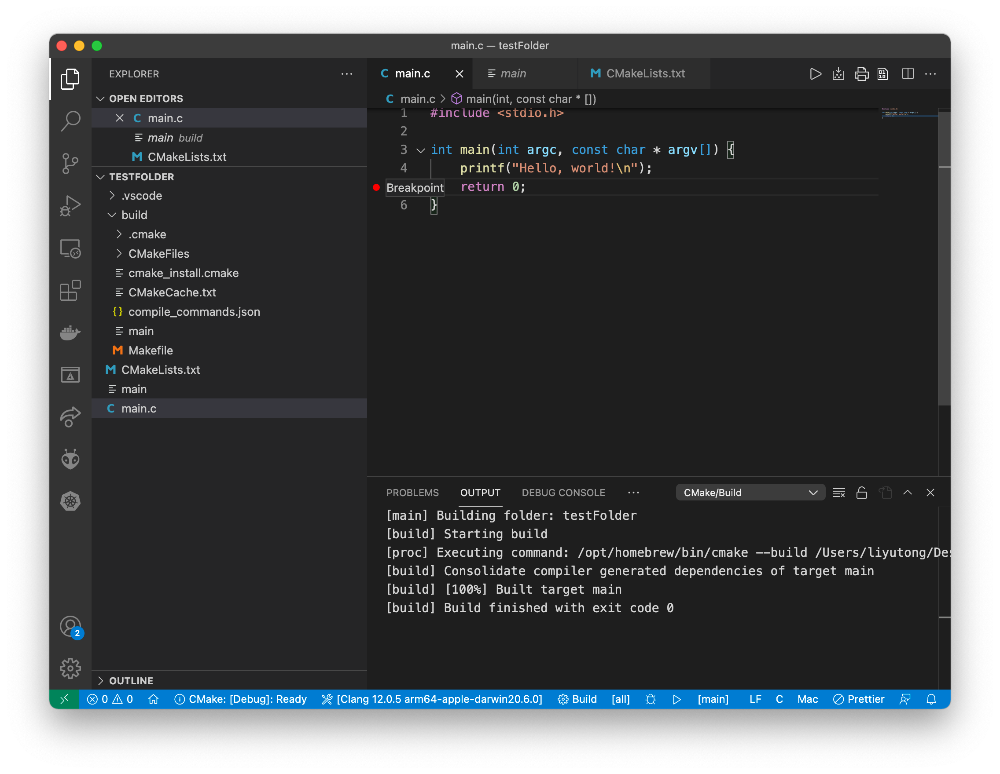

点击调试按钮，启动调试，程序会在断点停下。

M1 MacOS 可能会遇到一些奇怪的问题，建议使用`launch.json`配合`task.json`，详见[这篇文章](https://www.jianshu.com/p/c3806d2ad1f8)

## 更多信息

[Visual Studio Code Docs](https://code.visualstudio.com/docs) 有丰富的文档和视频可以参考
